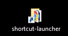

# Shortcut-Launcher

An [AutoHotkey](https://www.autohotkey.com/) script for Microsoft Windows to show a GUI that lets you incremental search and open shortcuts.

TODO Add GIF here

The following shortcuts are included:

- shortcuts (\*.lnk) stored in your folder and its subfolders
- web page links (\*.url) stored in your folder and its subfolders
- the recent files/folders automatically stored in `%AppData%\Microsoft\Windows\Recent\`

To specify your **folder** to look in add a shortcut to that folder on your desktop and name it `shortcut-launcher`:



## Contents

- [Incremental search](#incremental-search)
- [Text used for entries](#text-used-for-entries)
- [Key bindings](#key-bindings)
- [Compiled version](#compiled-version)
- [TODO](#todo)
- [Changelog](#changelog)

## Incremental search

As soon as you enter any key the list is filtered accordingly.

A space in the search string is a wildcard for matching any character 0 or more times. Example: `auto k or um` matches `autohotkey forum`

If the search string contains only lowercase letters the search is performed case insensitive. If the search string contains any uppercase letter the search is done case sensitive.

It combines the text from the 1st column (folder and shortcut name) & 2nd column (target) for the search. Matches in the 1st column have a higher priority and are placed at the top of the list view.

## Text used for entries

The text for each entry in the list view consists of two columns:

- **Path and file base name** - The directory where the shortcut is placed and the name of the shortcut. Path separators are replaced with `>`.
- **Target** - The target of the shortcut. This can be anything you can link to (file, folder, appliation, url).

Example:  
A shortcut named `forum` (forum.lnk) filed in your folder in the subfolder `coding/ahk` which has the target `https://www.autohotkey.com/boards/` will be listed as:

```text
| coding > ahk > forum | https://www.autohotkey.com/boards/ |
```

### Special cases

- **Shortcuts with browser profile** - Shortcuts to open an url with a specific browser profile are recognized and transformed.

  Example:  
  If the target of the shortcut is `%ProgramFiles(x86)%\Google\Chrome\Application\chrome.exe --profile-directory="Default" https://www.google.com` the target text is transformed into `(chrome) https://www.google.com`

## Key bindings

For convenience there are multiple bindings per command:

Changing selected shortcut (entry):

| Key                                  | Description            |
| :----------------------------------- | :--------------------- |
| <kbd>Ctrl-n</kbd> or <kbd>Down</kbd> | Select next entry      |
| <kbd>Ctrl-p</kbd> or <kbd>Up</kbd>   | Select previous entry  |
| <kbd>Ctrl-f</kbd>                    | Scroll down 20 entries |
| <kbd>Ctrl-b</kbd>                    | Scroll up 20 entries   |

Changing the search string:

| Key                                                  | Description                      |
| :--------------------------------------------------- | :------------------------------- |
| <kbd>Ctrl-u</kbd>                                    | Clear the input field            |
| <kbd>Alt-a</kbd>                                     | Select all text in input field   |
| <kbd>Ctrl-a</kbd>                                    | Move to beginning of input field |
| <kbd>Ctrl-e</kbd>                                    | Move to end of input field       |
| <kbd>Backspace</kbd> or <kbd>Ctrl-h</kbd>            | Backspace                        |
| <kbd>Ctrl-Backspace</kbd> or <kbd>Ctrl-Shift-h</kbd> | Delete last word                 |
| <kbd>Alt-d</kbd>                                     | Delete next word                 |

Open the selected shortcut:

| Key                                   | Description                                    |
| :------------------------------------ | :--------------------------------------------- |
| <kbd>Ctrl-m</kbd> or <kbd>Enter</kbd> | Open the currently selected shortcut           |
| <kbd>Alt-o</kbd>                      | If it is a file open its directory instead |

App:

| Key                                 | Description                         |
| :---------------------------------- | :---------------------------------- |
| <kbd>Ctrl-r</kbd>                   | Toggle showing recent files/folders |
| <kbd>Ctrl-g</kbd> or <kbd>Esc</kbd> | Minimize                            |
| <kbd>Ctrl-x</kbd>                   | Exit (kill the app)                 |

Remark: <kbd>Ctrl-h</kbd> seems to work by default as Backspace in the edit box.

## Compiled version

The compiled script (.exe, 64-bit) is included in this repository. You can compile it
yourself: Use the compiler provided by ahk. Press the win key and then search
for convert .ahk to .exe

## TODO

- [ ] Style: Change subroutines into functions and clean the script. Or rather use a
      class to create a namespace. See the hydra code.
- [ ] Feature: Add prefixes like U for url, P for path/folder, F for file.
- [ ] Features: Extract the profile if one is used for an url. Example:
      `%ProgramFiles(x86)%\Google\Chrome\Application\chrome.exe --profile-directory="Default" https://www.tenforums.com`
      The profiles in Firefox are not named, only numbered or so.
- [ ] Enhancement: Add hotkey to focus edit box.
- [ ] Feature: Add a possibility to ignore a path in recent.
- [ ] Feature: Multiple links folder.

## Changelog

### No stable release yet

- 2020-09-03 Automatically remove non-existing targets and duplicates in recent. There are two variables at the top to turn this off if you don't want this (`DeleteDuplicatesInRecent`, `DeleteNonExistingInRecent`).  It's turned on in the compiled version.
- 2020-08-18 Added open folder hotkey for files with <kbd>M-o</kbd>
- 2020-06-24 Stop flickering on updating the list view  
  Added +LV0x10000 to the list view to avoid flickering when the list view is updated.  
  https://autohotkey.com/board/topic/89323-listview-and-flashing-on-redrawing-or-editing/
